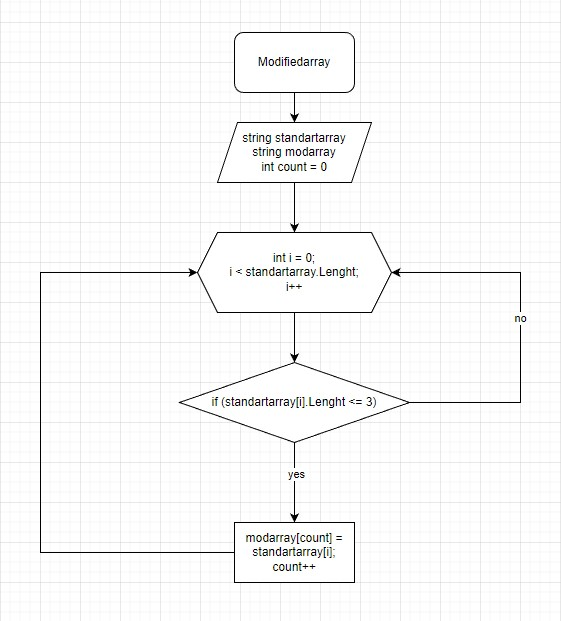

# __SummaryWork__
## __*Задача:*__ 
### Написать программу, которая из имеющегося массива строк формирует массив из строк, длина которых меньше, либо равна 3 символам. Первоначальный массив можно ввести с клавиатуры, либо задать на старте выполнения алгоритма. При решении не рекомендуется пользоваться коллециями, лучше обойтись исключительно массивами.
#
## _Описание алгоритма решения_
В первую очередь, необходимо объявить два массива. Первый - данный в условиях алгоритма массив и второй - пустой массив, идентичный размерами. Далее, создается метод, в котором присутствует цикл для проверки условия задачи (длина меньше, либо равна 3 (<=3)). В случае, если элемент изначального массива удовлетворяет условия задачи, то этот элемент заносится во второй массив при помощи переменной count, созданной для того, чтобы поочередно проверять элементы первого массива и отправлять подходящие во второй массив. В случае присвоения, переменная count увеличивается на 1, далее, алгоритм возвразается к циклу for, в котором переменная i увеличивается на 1 для постепенной проверки массива целиком.
#
## _Схема главного метода алгоритма решения_

